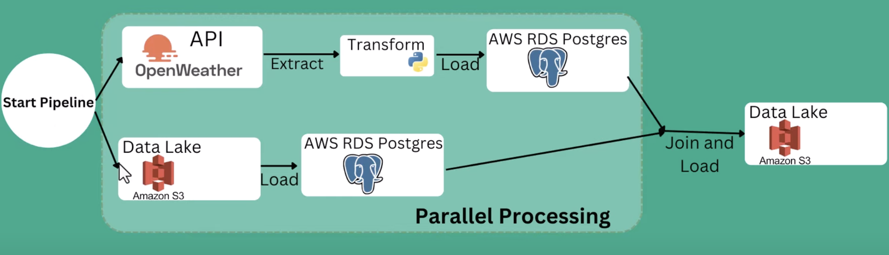
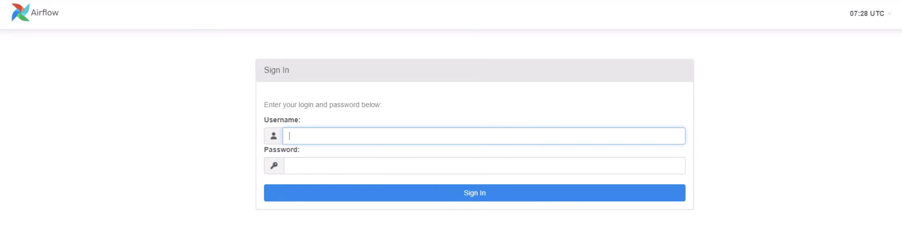
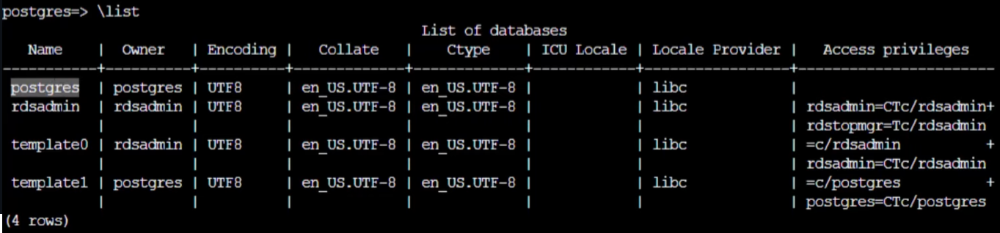
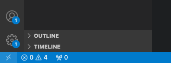
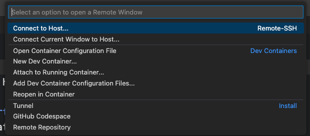
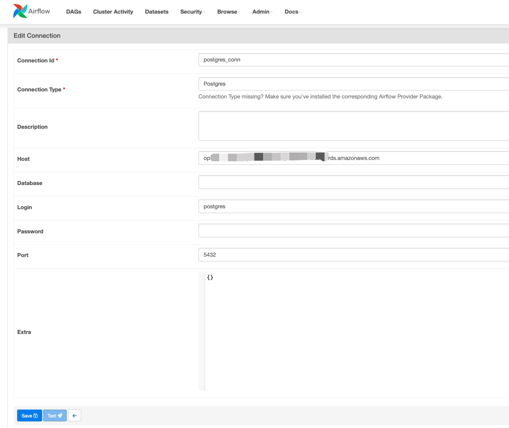
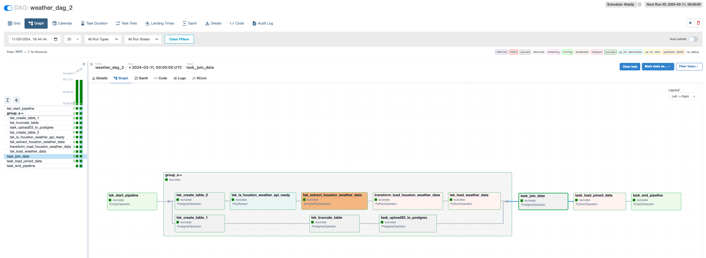
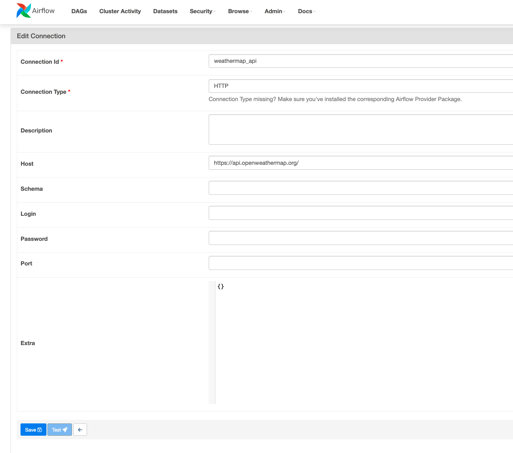

# Build and automate a python ETL pipeline with airflow on AWS EC2
[](https://skillicons.dev)

## Table of Contents
- [Introduction](#introduction)
- [Openweather API Key](#openai-api-key)
- [Create RDS Instance](#create-rds-instance)
- [Install Dependencies On ec2 and AWS CLI Configuration](#install-dependencies-on-ec2-and-aws-cli-configuration)
- [Remotely SSH Visual Studio Code to AWS ec2](#remotely-SSH-visual-studio-code-to-AWS-ec2)
- [Create Dag](#create-dag)
- [Usage](#usage)


## [Introduction](#introduction) 
Apache Airflow is an open-source platform used for orchestrating and scheduling workflows of tasks and data pipelines.
Previously, I outlined some basic processes of building a Python ETL pipeline with airflow on AWS EC2 in repository [Airflow_ETL](https://github.com/fyshark/Airflow_ETL/tree/main).
In this repository, we will learn how to parallelize tasks. We will run airflow on AWS EC2 and use AWS RDS Postgres instance database as the database.

The high-level architecture of this project is as below:


## [Create RDS Instance](#create-rds-instance)
Create RDS Instance

1. Open your AWS RDS console -> Click `Create database` -> Choose `PostgreSQL` as your Engine options -> Select `Free Tier` template -> Set your DB instance identifier -> Set up your `Master password` 
-> Select `db.t3.micro` for instance configuration -> Choose `Public access` as `Yes` -> Set up your `VPC security group`, add `5432` as Database port -> Finish `Create database`

2. Once you created your RDS instance, click into the `VPC security groups` you set previsouly and edit inbound rules, make sure port `5432` was added.

## [Openweather API Key](#openai-api-key)
Obtain an API key

This part was covered in my previvous repository [Airflow_ETL]([https://github.com/fyshark/Airflow_ETL/tree/main](https://github.com/fyshark/Airflow_ETL/blob/main/README.md#openai-api-key)).


## [Install Dependencies On ec2 and AWS CLI Configuration](#install-dependencies-on-ec2-and-aws-cli-configuration)

Commands used when installing dependencies on ec2

1. For this part I will provide the command I used for the dependencies installation. Make sure you created an ec2 instance beforehand, having the security group and private key set up or created,
   make sure port `8080` and `5432` is listened to, I used `t2.medium` as instance type and `ubuntu` as OS, once you SSH your ec2, run the command below to install dependencies as needed:
   
Update and install packages:   
```
sudo apt update
```
```
sudo apt install python3-pip
```
```
sudo apt install python3.10-venv
```

Create a new virtual environment named airflow_venv:
```
python3 -m venv airflow_venv
```

Activate your virtual environment (Unix/macOS):
```
source airflow_venv/bin/activate
```

For Windows system, use the below command instead to activate:
```
.\airflow_venv\Scripts\activate.bat
```

Then install the necessary packages inside the virtual environment:
```
sudo pip install fsspec
```
```
sudo pip install pandas
```
```
sudo pip install s3fs
```
```
sudo pip install apache-airflow
```
```
sudo pip install apache-airflow-providers-postgres
```
Lastly, you can run this command to run Apache Airflow in standalone mode:
```
airflow standalone
```
2. Go to your instance to copy your `Public IPv4 DNS` to your browser and add `:8080` at the end,
then you'll see this login page:



3. Use username and password shows in terminal to login your airflow account.

4. In order to use PostgreSQL on ec2, you need to install PostgreSQL clients, steps and commands are available on this [PostgreSQL website](https://www.postgresql.org/download/linux/ubuntu/).

Create the file repository configuration:
```
sudo sh -c 'echo "deb https://apt.postgresql.org/pub/repos/apt $(lsb_release -cs)-pgdg main" > /etc/apt/sources.list.d/pgdg.list'
```

Import the repository signing key:
```
sudo sh -c 'echo "deb https://apt.postgresql.org/pub/repos/apt $(lsb_release -cs)-pgdg main" > /etc/apt/sources.list.d/pgdg.list'
```

Update the package lists:
```
sudo apt-get update
```

Install the latest version of PostgreSQL:
```
sudo apt-get -y install postgresql
```

Before you can use Amazon S3 with your RDS for PostgreSQL DB instance, you need to install the aws_s3 extension.

1. To install the aws_s3 extension, you can follow the steps on Amazon AWS [Documentation](https://docs.aws.amazon.com/AmazonRDS/latest/UserGuide/USER_PostgreSQL.S3Import.html):
- Use psql (or pgAdmin) to connect to the RDS for PostgreSQL DB instance as a user that has `rds_superuser` privileges. If you kept the default name during the setup process, you connect as postgres.
```
psql -host {your-rds-endpoint} -p 5432 -U postgres -W
```

Enter your master password for your RDS DB.

Once it's connected, enter `\list` to see the list of database you have, you'll see a database named `postgres` which is a default one as below:



2. To install the extension, run the following command.

`postgres=> CREATE EXTENSION aws_s3 CASCADE;`

3. Install awscli and configure it:

```
sudo apt install awscli
```

Now, what we need is called Access key and Secret key. Go to your `Security credentials`, click `Create access key`, then you can save your Access key and Secret key somewhere.

```
aws configure
```

Type in your Access key, Secret Access key, Default region key, etcs as prompted.

4. Once you created your s3 Bucket for this project, should set up access to the Amazon S3 bucket,
you can use an IAM role to access an Amazon S3 bucket to give an RDS for PostgreSQL DB instance access to Amazon S3 through an IAM role.

Enter `\q` to quit postgres, copy this command in your terminal (For Linux, macOS, or Unix), remember to change your policy name and s3 Bucket name
```
aws iam create-policy \
   --policy-name your-policy-name \
   --policy-document '{
     "Version": "2012-10-17",
     "Statement": [
       {
         "Sid": "s3import",
         "Action": [
           "s3:GetObject",
           "s3:ListBucket"
         ],
         "Effect": "Allow",
         "Resource": [
           "arn:aws:s3:::your-s3-bucket", 
           "arn:aws:s3:::your-s3-bucket/*"
         ] 
       }
     ] 
   }'
```

For Windows:
```
aws iam create-policy ^
   --policy-name rds-s3-import-policy ^
   --policy-document '{
     "Version": "2012-10-17",
     "Statement": [
       {
         "Sid": "s3import",
         "Action": [
           "s3:GetObject",
           "s3:ListBucket"
         ], 
         "Effect": "Allow",
         "Resource": [
           "arn:aws:s3:::your-s3-bucket", 
           "arn:aws:s3:::your-s3-bucket/*"
         ] 
       }
     ] 
   }'             
```

5. Create an IAM role. You do this so Amazon RDS can assume this IAM role to access your Amazon S3 buckets. For Linux, macOS, or Unix:

```
aws iam create-role \
   --role-name your-role-name \
   --assume-role-policy-document '{
     "Version": "2012-10-17",
     "Statement": [
       {
         "Effect": "Allow",
         "Principal": {
            "Service": "rds.amazonaws.com"
          },
         "Action": "sts:AssumeRole"
       }
     ] 
   }'
```

For Windows:

```
aws iam create-role ^
   --role-name rds-s3-import-role ^
   --assume-role-policy-document '{
     "Version": "2012-10-17",
     "Statement": [
       {
         "Effect": "Allow",
         "Principal": {
            "Service": "rds.amazonaws.com"
          },
         "Action": "sts:AssumeRole"
       }
     ] 
   }'
```

6. Attach the IAM policy that you created to the IAM role that you created.

For Linux, macOS, or Unix:

```
aws iam attach-role-policy \
   --policy-arn your-policy-arn \
   --role-name your-role-name                   
```

For Windows:

```
aws iam attach-role-policy ^
   --policy-arn your-policy-arn ^
   --role-name your-role-name     
```
7. Add the IAM role to the DB instance by AWS CLI.

For Linux, macOS, or Unix:
```
aws rds add-role-to-db-instance \
   --db-instance-identifier my-db-instance \
   --feature-name s3Import \
   --role-arn your-role-arn   \
   --region your-region
```

For Windows:

```
aws rds add-role-to-db-instance ^
   --db-instance-identifier my-db-instance ^
   --feature-name s3Import ^
   --role-arn your-role-arn ^
   --region your-region     
```

To acquire Policy ARN, go to IAM -> Policies -> your-policy, ARN would be available inside the Policy details.

Before we start the Dag building, import the .csv file [us_city.csv](https://github.com/fyshark/Airflow_ETL_Parallel/blob/main/us_city.csv) to your s3 bucket.


## [Remotely SSH Visual Studio Code to AWS ec2](#remotely-SSH-visual-studio-code-to-AWS-ec2)
How to remotely SSH (connect) Visual Studio Code to AWS EC2:

1. Click the button at the left bottom to open a remote window:


2. Connect host:


3. Once you get into the remote machine folder `Home/Ubuntu`, open the file `.ssh` inside your local user folder.

4. Edit your config file inside `.ssh`, which should follow this pattern:
```
Host your-instance-name
    Hostname Public-IPv4-address
    User ubuntu
    IdentifyFile your-key-pair-pem-path
```

## [Create Dag](#create-dag)
1. Make a Python file inside airflow folder, say `weatherapi_dag.py` and make the necessary import.
```python
from airflow import DAG
from datetime import timedelta, datetime
from airflow.operators.dummy_operator import DummyOperator
from airflow.utils.task_group import TaskGroup
from airflow.providers.postgres.operators.postgres import PostgresOperator
from airflow.providers.http.sensors.http import HttpSensor
import json
from airflow.providers.http.operators.http import SimpleHttpOperator
from airflow.operators.python import PythonOperator
import pandas as pd
from airflow.providers.postgres.hooks.postgres import PostgresHook

// DAG and Default Arguments
default_args = {
    'owner': 'airflow',
    'depends_on_past': False,
    'start_date': datetime(2023, 1, 8),
    'email': ['youremail@domain.com'],
    'email_on_failure': False,
    'email_on_retry': False,
    'retries': 2,
    'retry_delay': timedelta(minutes=2)
}

with DAG('weather_dag_2',
        default_args=default_args,
        schedule_interval = '@daily',
        catchup=False) as dag:

        start_pipeline = DummyOperator(
            task_id = 'tsk_start_pipeline'
        )

        join_data = PostgresOperator(
                task_id='task_join_data',
                postgres_conn_id = "postgres_conn",
                sql= '''SELECT                   
                    FROM weather_data w
                    INNER JOIN city_look_up c
                        ON w.city = c.city                                      
                ;
                '''
            )

        load_joined_data = PythonOperator(
            task_id= 'task_load_joined_data',
            python_callable=save_joined_data_s3
            )

        end_pipeline = DummyOperator(
                task_id = 'task_end_pipeline'
        )

        with TaskGroup(group_id = 'group_a', tooltip= "Extract_from_S3_and_weatherapi") as group_A:
            create_table_1 = PostgresOperator(
                task_id='tsk_create_table_1',
                postgres_conn_id = "postgres_conn",
                sql= '''  
                    CREATE TABLE IF NOT EXISTS city_look_up (
                    city TEXT NOT NULL,
                    state TEXT NOT NULL,
                    census_2020 numeric NOT NULL,
                    land_Area_sq_mile_2020 numeric NOT NULL                    
                );
                '''
            )
// Declare Task Dependencies
        create_table_1 >> truncate_table >> uploadS3_to_postgres
        create_table_2 >> is_houston_weather_api_ready >> extract_houston_weather_data >> transform_load_houston_weather_data >> load_weather_data
    start_pipeline >> group_A >> join_data >> load_joined_data >> end_pipeline

```
The weather API availability check must pass `is_weather_api_ready` before the weather data can be fetched `extract_weather_data`. 
Once the data is successfully fetched, it is then transformed and loaded `transform_load_weather_data`.

2. Set the host as the RDS endpoint in Airflow's connection settings allows Airflow to correctly and securely target the specific Amazon RDS instance where your database is hosted.

Go to Airflow Admin -> connections -> edit `Connection Id`, `Connection Type`, `Host`, `Login`, `Password`, `Port` as needed. 
Here, `Host` should be filled in with your RDS instance endpoint, `Login` should be postgres, `Password` is what you set up for RDS master password before, `Port` is 5432.

You will see the Airflow connection setting page as below:


Make sure the `Connection Id` is identical to the variable `postgres_conn_id` in your code.

3 . Then you'll see the Dag graph below:


- start_pipeline → group_A:

The `start_pipeline` is a DummyOperator that signifies the start of the DAG. It does not perform any action but serves as a starting point in the workflow.
`group_A` is a TaskGroup which means it contains multiple tasks grouped for organizational purposes. The tasks within this group will start once the `start_pipeline` task is completed.

- Within `group_A`:

- create_table_1 → truncate_table → uploadS3_to_postgres:
`create_table_1` uses `PostgresOperator` to create a `city_look_up` table if it doesn’t exist.
`truncate_table` is then responsible for clearing this table to prepare for new data insertion.
`uploadS3_to_postgres` loads data from an S3 CSV file into the `city_look_up` table.

- create_table_2 → is_houston_weather_api_ready → extract_houston_weather_data → transform_load_houston_weather_data → load_weather_data:

`create_table_2` creates another table called `weather_data`.
`is_houston_weather_api_ready` is an HttpSensor that waits until the OpenWeather API is available for Houston's weather data.
`extract_houston_weather_data` fetches the weather data from the OpenWeather API.
`transform_load_houston_weather_data` uses a PythonOperator to transform the weather data using the `transform_load_data` function.
`load_weather_data` loads the transformed weather data into the `weather_data` table in PostgreSQL.

- group_A → join_data:

Once all tasks in group_A have been completed, the join_data task is executed.
`join_data` performs an SQL JOIN operation between the `weather_data` and `city_look_up` tables and selects relevant columns.

- join_data → load_joined_data:

After `join_data` is completed, `load_joined_data` takes over.
`load_joined_data` uses a PythonOperator to call the `save_joined_data_s3` function, which saves the joined data to a CSV file in an S3 bucket.

- load_joined_data → end_pipeline:

The `end_pipeline` is another DummyOperator indicating the end of the DAG process after `load_joined_data` has successfully saved the joined data to S3.

4. Make sure you set up the http_conn_id variable inside Airflow's connection configurations as below, which allows you to manage HTTP connections centrally, including endpoints, credentials, and other HTTP-related settings.
The endpoint part in the code can be found from your Openweather API account.



6. Then, you'll see the graph status updated as below:


## [Usage](#usage)

### That's it 🌟! Now, you can automate the ETL process to parallelly fetch and process Houston's weather data and static city data, merging them for storage in S3!
### The project showcases a practical application of ETL (Extract, Transform, Load) processes in data engineering, leveraging Airflow for workflow automation, the OpenWeather API for real-time data collection, PostgreSQL for data storage and manipulation, and Amazon S3 for data archiving. 
### This setup is beneficial for scenarios requiring up-to-date weather data analysis, urban planning, environmental monitoring, and more, providing a solid foundation for data-driven decision-making.

